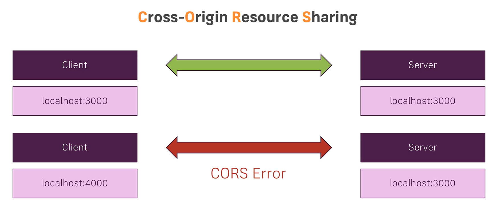
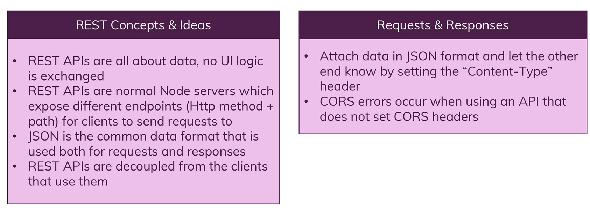
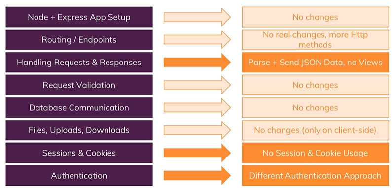

# Basics

- Not every frontend (UI) requires HTML pages like mobile apps(React Native, Android, iOS), these UI are build totally decoupled from the server, they don't need any HTML code
- Other examples that doesn't need HTML pages are Single Page Web Apps(React etc), Service APIs(eg: Google Maps APIs)
- Doesn't need HTML code, just need backend that needs to serve the data : this is code idea for building Rest APIs because here we need different kind of responses (not HTML views)
- 
- REST: Representational state transfer; i.e transfer data instead of User Interfaces
- Only the response & request data changes, NOT the general server side logic
- 
- We can exhcange data in many formats
- 
- 
- 
- 

# Project setup

- npm init
- npm i --save express
- npm i --save-dev nodemon
- "start": "nodemon app.js" : Add this to scripts in package.json
- npm i --save body-parser (to parse incoming requests)

# Implementation

- Return json response from controllers
- Test APIs using Postman

# CORS

- Cross Origin Resource Sharing
- By default it is not allowed by browsers
- 
- To solve this CORS error, we need to set some special headers
- 

# More Implementation

- 
- getPosts API
- createPost API
- npm i --save express-validator
- npm i --save mongoose
- To add created & updated at automatically in mongoose schema we can add timestamps:true constructor
- To statically serve images, add middleware in app.js
